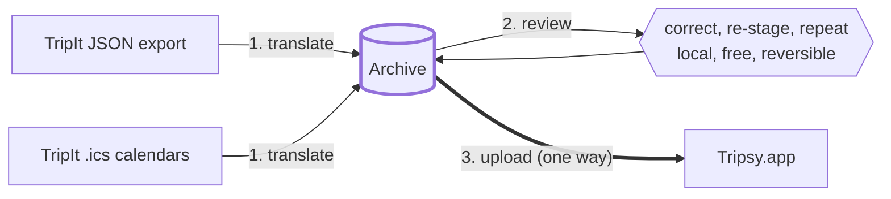
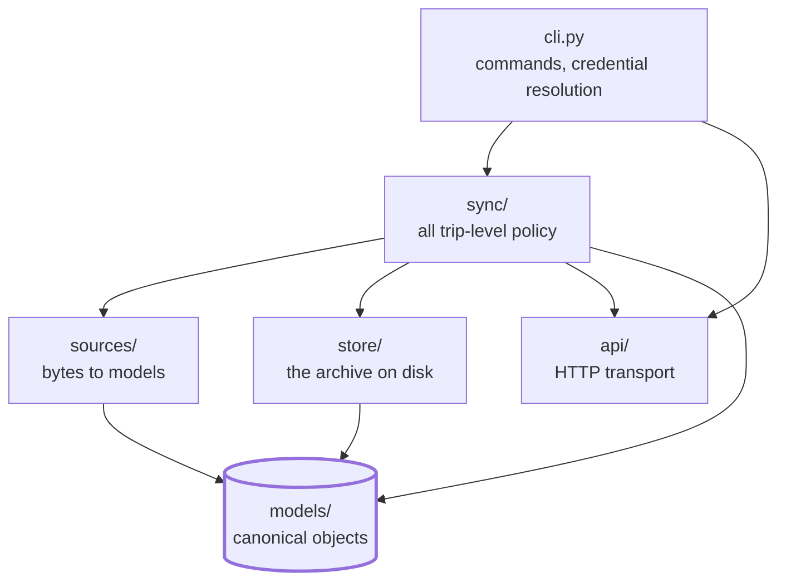

# tripsy-exim

Export and import trip data for [Tripsy.app](https://tripsy.app).

## Why

TripIt disabled its third-party integrations on 2026-08-29, returning `404`
to any new connection attempt
([announcement](https://tripsy.blog/tripit-third-party-integrations-are-no-longer-working/)).
Existing connections reportedly still work, but a Tripsy account created
after that date can never link one -- so years of TripIt trip data have no
supported path into the service that replaced it.

That is the first half of this project: get the data in, from TripIt's JSON
export of your account or from the per-trip `.ics` files TripIt will still
hand you.

TripIt does not offer that export from the app. The way to get one is to
email `support@tripit.com`, from the address you sign in to TripIt with,
asking for a "GDPR Request - complete JSON export of my personal account
data". The reply has arrived within a couple of days, with the file
attached to it. That file is ordinary JSON and carries no GDPR-specific
structure, which is why the rest of these documents simply call it the
TripIt JSON export.

The second half follows from the first. Being locked inside a service is
what created the problem, so `tripsy-exim` also keeps a complete, current,
local copy of your trips in a provider-neutral format. If you ever move
again, you move with your data.

## Status

The import path works end to end: a TripIt JSON export or a `.ics` is
parsed into a local archive, corrected there, uploaded to Tripsy, read
back and checked, and anything Tripsy left unplaced on the map is
geocoded afterwards.

**The TripIt JSON export is the path that has actually been exercised.**
Nearly all of the development and testing has run against one -- it
carries a whole account in a single file, it is authoritative for a
trip's identity, and it is what the identifier namespaces, the classifier
and the override machinery were shaped against. The `.ics` path works and
is tested, but it has seen far less real data, and a calendar can express
less about a trip than the export can.

Pulling a whole Tripsy account back down is **not written yet**: there is
no `sync/exporter.py` and no command that calls one. Today the archive is
filled by staging a source, not by reading Tripsy.

The shape of it is settled, though. An export writes a complete dated
snapshot into an archive of its own rather than updating one in place.
See [Exporting from Tripsy](#exporting-from-tripsy).

See [CHANGELOG.md](CHANGELOG.md) for what has actually shipped.

## Installation

Requires Python 3.14 and [uv](https://docs.astral.sh/uv/).

```sh
git clone https://github.com/scanner/tripsy-exim.git
cd tripsy-exim
make setup
```

## Running the commands

This project is managed with uv, and `tripsy-exim` lives in the project's
virtual environment rather than on your `PATH`. From a fresh clone, run
every command through `uv run`:

```sh
uv run tripsy-exim list
```

Every example in this README and in [docs/](docs/) is written that way,
because it is the form that works with no further setup. `uv run` is a
launcher and no part of the command itself -- activating the environment
with `source .venv/bin/activate`, or installing the project with
`uv tool install .`, puts `tripsy-exim` on your `PATH` as a plain command
instead. See [docs/README.md](docs/README.md#running-the-commands).

## What the project is made of

Four parts, in the order data moves through them.

### 1. The object model

Six pydantic models -- `Trip`, `Activity`, `Hosting`, `Transportation`,
`Expense` and `Collaborator` -- are the canonical form of a trip, and the
hinge every other layer turns on. Parsers produce them, the importer sends
them, the archive stores them.

**The object set is a one to one mapping onto Tripsy's.** One model per
kind of thing in a Tripsy account, no renaming of fields in either
direction, no model that is two Tripsy objects and no Tripsy object split
across two models.

**The field set is a superset.** The models are provider-neutral -- Tripsy
is the first service they are mapped to, not the shape they were derived
from -- so they also retain source fields Tripsy has nowhere to put, and
undocumented fields Tripsy returns. A `WRITABLE` set on each model
projects that superset back down to exactly what Tripsy's own endpoint
accepts, and is the only thing that builds a request body.

See [models(7)](docs/models.md) for the mapping in full, the places
Tripsy is not uniform across its own endpoints, and what happens to a
payload that will not parse.

### 2. The API client

`tripsy_exim.api` is the whole of the project's contact with Tripsy:
transport, authentication headers, routes, payload shapes, pagination,
retries, and the mapping from status codes to exceptions. It reads,
creates and modifies trips and everything on them.

It knows nothing about import or export policy and never decides what
should be written -- a caller hands it a token and tells it what to do.
Keeping Tripsy-specific knowledge inside this one package is what makes
supporting another service later a new adapter rather than a rewrite.

Two version rules run through every route: writes go to v1, which is the
only version that accepts them, and reads go to v2, which paginates at
100 and is the only version that reports deletions.

Every call is paced -- see [Pacing](#pacing) below.

### 3. The command line

Seven commands for the ordinary interactions: staging a source, listing
what is staged, declaring a merge, uploading, verifying, and geocoding
what Tripsy left unplaced. Each has its own page in [docs/](docs/).

The command line is also the only place credentials are resolved. Nothing
below it reads the environment, runs a secret store, or holds a password.

### 4. The archive

One directory holding the provider-neutral copy of the data: the
canonical form of every trip, the corrections made to them, and a record
of what has been uploaded and what Tripsy called it.

The archive is not a cache. It is the reason for the project's second
half, so it lives in durable storage, it is meant to be backed up, and it
is plain indented JSON with sorted keys that is safe to read with
ordinary tools.

Staging is lossless: a parser writes what it inferred and nothing else, so
re-staging a source never clobbers a decision made by hand. Decisions live
in `overrides/`, keyed separately, and are laid over on the way out to
Tripsy. See [archive(7)](docs/archive.md).

There will eventually be two of these. This one is the *staging* archive:
it records what a source gave us and is never written back to from
Tripsy. The export side writes a second archive in the same format,
holding what Tripsy actually holds -- including corrections people made
in the app that no source can reproduce. The two diverging is the
expected state, not drift to be reconciled.

## Identifiers, and why imports are idempotent

`internal_identifier` is **Tripsy's own field**, not something this
project invented: a string the API stores on a trip, activity, hosting or
transportation, and treats as an **idempotency key**. POSTing an object
whose identifier Tripsy already holds returns an empty `200` rather than
creating a second one. Expenses and collaborators do not have the field
at all.

`tripsy-exim` mints the value it puts there from the source record, so it
is derived rather than random:

```text
txim-tripit-json-g01-52b4a7ef87e23b68
```

The same source record therefore always produces the same identifier --
across runs, machines, and rebuilds of the archive. That is the whole
mechanism behind two properties worth relying on: **re-running an import
is a no-op rather than a pile of duplicates**, and a run that failed part
way is resumed by running it again.

Three limits are worth knowing before a large import:

- **An identifier is never released.** A deleted object keeps its own, so
  deleting a trip in the app and re-running the upload that created it
  brings back nothing. The only way back is a different identifier for
  the same record, which is what the generation segment (`g01`) is for.
  Raising a generation is a deliberate act, not something a re-run does.
- **Suppression is scoped to one collection of one trip.** An object that
  changes *type* between runs -- an activity reclassified as a
  transportation -- is created afresh alongside the original rather than
  moved.
- **Trip-level suppression only engages above five characters.** Child
  objects suppress at any length. Minted identifiers clear this by a wide
  margin; it bounds what a hand-written identifier may be.

Because a mistaken create cannot be undone, `upload` plans and prints
without sending unless given `--write`. Read the plan first. See
IDENTIFIERS in [archive(7)](docs/archive.md) for the anatomy of an
identifier and what `--scratch` is for.

## Workflows

There is more than one way through this toolkit, and they share the
archive rather than sharing commands. Today one of them is written.

### Importing from another service

This is what the project was built for, and for most people it happens
once.

> **To actually do it, follow
> [Importing your TripIt trips into Tripsy](docs/importing.md).** That is
> the step-by-step guide, with a worked example. What follows here is
> the shape of it and why it is built this way.

The shape is three stages with the archive in the middle:



**1. Translate the source into the archive.** `stage-export` reads a
TripIt JSON export -- a whole account in one file -- and `stage` reads
`.ics` calendars. Either way what lands on disk is canonical objects in
this project's own format, plus a `report.json` per trip saying what the
parser made of the source. Nothing touches the network and no credentials
are needed.

**2. Review and correct it, locally.** Read the report, find what the
parser guessed badly, and write corrections. Corrections live in
`overrides/` keyed by the source record's uuid, *separate* from the staged
files -- so re-staging never clobbers a decision you made by hand, and a
correction survives a re-export or a change of identifier namespace.

**3. Upload, and check what arrived.** `upload` plans and prints by
default; `--write` sends. `--limit` works oldest first, so you can take
one trip, look at it in the app, and then take the next. `verify` reads
trips back and compares them to the plan, and `fix-locations` geocodes
whatever Tripsy left without a position.

```sh
uv run tripsy-exim stage-export ~/Downloads/tripit-export/export.json
uv run tripsy-exim list
uv run tripsy-exim upload --limit 1 --verbose     # plan only; the default
uv run tripsy-exim upload --limit 1 --write
uv run tripsy-exim verify --limit 1
uv run tripsy-exim fix-locations --trip 'Lakeside' --write
```

#### Why the archive sits in the middle

Because the two halves of that picture have opposite costs, and putting a
durable local stage between them is what keeps the expensive half rare.

**Everything before the upload is free and repeatable.** Staging never
touches the network. You can re-stage the same export as many times as you
like -- the identifiers are derived from the source records, so the same
files are written again, and objects a re-parse no longer produces are
cleaned up. You can delete the whole archive and rebuild it from scratch.

(One asymmetry: re-running `stage-export` over the same export is always
allowed, but `stage` *refuses* a calendar naming a trip the archive
already holds from an export, rather than staging it twice. The export is
authoritative for a trip's identity -- see
[stage-export(1)](docs/stage-export.md).) You can tweak your corrections, throw them away, and write
different ones. None of it is visible to Tripsy, because none of it
reaches Tripsy. Take as many passes as you want, and upload only when you
are satisfied with what you are looking at.

**The upload is the one-way door.** Tripsy never releases an
`internal_identifier`, so an object created by mistake cannot be undone by
deleting it -- see [Identifiers](#identifiers-and-why-imports-are-idempotent).
That asymmetry is the whole argument for the local stage: get it right
where getting it wrong costs nothing.

Even the upload has a rehearsal. `--scratch` stages into a throwaway
identifier namespace, so a whole run can be uploaded against the real
account, inspected, deleted, and done again without spending any of the
identifiers the real import will want.

None of this is a claim that the import has to be perfect. You can edit
anything in the Tripsy app afterwards, and people do. The goal is to make
the *initial* state as good as it can be, because every correction is
cheaper here than it is later -- in the archive it is a file you can
rewrite, and in the app it is hand-editing one object at a time.

#### One format, both directions

The two directions keep separate archives, as above, but not separate
schemas. One provider-neutral format is what a parser translates *into*
and what an export from Tripsy is written *as*. That is why it is plain
sorted JSON in durable storage rather than a scratch directory, and why
[models(7)](docs/models.md) is a provider-neutral object model rather
than a TripIt reader's output.

The staging archive lands in one directory, named by `--archive`, or
`$TRIPSY_EXIM_ARCHIVE`, or `~/.local/share/tripsy-exim/archive`.

#### Stage 2, in practice

[backfill(1)](docs/backfill.md) is what stage 2 is made of: it says what
the parser was unsure of and what Tripsy would have no way to place,
fills in what your own archive can answer, and hands you the rest as an
editable file. The [importing guide](docs/importing.md) walks it.

The override format underneath is documented in
[archive(7)](docs/archive.md), and corrections are applied on the way
out rather than written back to the staged files -- which is why
re-staging never clobbers one.

#### One format, both directions

The two directions keep separate archives, as above, but not separate
schemas. One provider-neutral format is what a parser translates *into*
and what an export from Tripsy is written *as*. That is why it is plain
sorted JSON in durable storage rather than a scratch directory, and why
[models(7)](docs/models.md) is a provider-neutral object model rather
than a TripIt reader's output.

The staging archive lands in one directory, named by `--archive`, or
`$TRIPSY_EXIM_ARCHIVE`, or `~/.local/share/tripsy-exim/archive`.

#### Stage 2, in practice

[backfill(1)](docs/backfill.md) is what stage 2 is made of, and it runs
in four steps between staging and uploading:

```sh
uv run tripsy-exim backfill infer --write   # what the archive knows
uv run tripsy-exim backfill report          # what is left for you
uv run tripsy-exim backfill draft work.json
uv run tripsy-exim backfill apply work.json --write
```

`infer` fills what the archive can work out from itself -- an airport
one trip left unplaced was usually placed by another -- so the list a
person reads is only what the archive could not answer. The rest is a
JSON work-list: every row arrives pre-filled with what the object holds
now, and only what you change is written, so a row you skip does nothing
and the same file applied twice does nothing the second time.

The override format underneath is documented in
[archive(7)](docs/archive.md), and corrections are applied on the way
out rather than written back to the staged files -- which is why
re-staging never clobbers one.

### Exporting from Tripsy

Not written yet, and when it is it will not be the import run backwards.

Each run writes a **complete snapshot** under its own UTC timestamp, into
an archive of its own. Deliberately not incremental: a snapshot is a
point in time that reads on its own, deletion is simply absence from a
complete run, and there is no watermark to keep correct. `--trip` narrows
a run to a subset, and every snapshot records its own scope -- a partial
run says nothing about the trips it did not ask for, and without that
recorded, absence would read as deletion.

Nothing in a trip says when it last changed -- Tripsy returns no
`updated_at` on one -- so the timestamp a snapshot is written under is
what dates the data inside it. Two snapshots compared then say what
changed between those two instants, which is change detection that costs
no requests and keeps no watermark correct.

Snapshots accumulate and are managed by hand. Nothing prunes them.

## Credentials

### What Tripsy needs

Tripsy's `POST /auth` trades a **username and password** for an **API
token**, which is then sent on every request as
`Authorization: Token <token>`. That is the whole of the scheme; there is
no separate API key to provision.

The token has no stated lifetime -- these appear to be Django REST
Framework tokens, which are not documented to expire -- so the only way to learn one is spent is to be
refused, and a run that is told `401` re-authenticates once and carries
on.

A password is never written to disk by this project, and no credentials
file is created. The token is a different matter: when a writable secret
store is configured, the token is cached **into that store** so the next
run sends no credentials at all. A cached token is exactly as powerful as
the password that produced it, which is why it goes back into the store
rather than into a file beside the archive. With no store configured,
nothing is persisted at all and the token lives in memory for the run.

Commands that only read or write the archive -- `stage`, `stage-export`,
`list`, `merge`, and `upload` without `--write` -- need no credentials.

### Where the credentials come from

Resolution order, first match wins:

1. `--username` / `--password` on the command
2. `TRIPSY_USERNAME` / `TRIPSY_PASSWORD` in the environment, or in `.env`
3. A credential store named by `TRIPSY_SECRET_URL`

The store is last because it is the one form that keeps a plaintext
password out of the environment entirely, so anything more explicit is a
deliberate override of it.

`.env` is searched for from the working directory upwards, so running
from anywhere inside a project finds that project's file. This is the
same whichever way you launch the command.

### Storing them on your behalf

Letting a credential store hold the username and password is optional.
It is the form to prefer for scheduled or unattended runs, and it is the
only one that also caches the token.

A store is named by a URL whose scheme picks the backend:

| Scheme                            | Backend         | Status                    |
|-----------------------------------|-----------------|---------------------------|
| `op://<vault>/<item>`             | 1Password       | Supported                 |
| `hcvault://<host>/<mount>/<path>` | HashiCorp Vault | Reserved, not implemented |

More backends may be added; the scheme is the seam a new one arrives at,
so this table is the directory of what is understood today.

#### 1Password -- `op://<vault>/<item>`

**Using an `op://` URL requires the 1Password `op` command line tool to
be installed and signed in locally.** `tripsy-exim` shells out to it; it
does not talk to 1Password any other way. See
[1Password's own documentation](https://developer.1password.com/docs/cli/)
for getting it.

With `op` in place:

```sh
export TRIPSY_SECRET_URL="op://Personal/Tripsy"
```

That is an *item* URL, naming the vault and the item and no field. Its
`username` and `password` fields are read when a command needs to
authenticate, and the token is written back to a `token` field on the
same item as a concealed value. An item that has never carried a `token`
field is the ordinary starting state, not an error.

Set `TRIPSY_OP_BIN` if `op` is not on the `PATH`, or if more than one is
and the account you want is reachable only through a particular one.

#### HashiCorp Vault -- `hcvault://<host>/<mount>/<path>`

Named but not implemented: an `hcvault://` URL is refused with a message
saying so. The grammar is reserved now so that a URL someone writes today
still means the same thing when the backend exists -- the host falls back
to `VAULT_ADDR` when the URL omits it, the first path segment is the
secret engine's mount point, and the rest is the path under it. Always KV
version 2.

## Pacing

Tripsy publishes no rate limit and sends no rate-limit headers, so there
is nothing to read and no way to find a limit except by hitting it. The
client sets its own pace from the one signal the API does give -- how long
it takes to answer -- and waits roughly as long as the last response took
before sending the next. A fast API is still paced; a slowing one is
backed away from, up to a ceiling. Should a `Retry-After` ever arrive it
takes precedence, raising the floor for the rest of the run and decaying
back as calls succeed.

Pacing lives in an `httpx` transport rather than in each route, so it
cannot be gone around, and the pace is shared across a whole run rather
than per-request. Three profiles match how this gets used:

| Profile       | For                                | Gap per second of latency | Floor | Ceiling | Timeout |
|---------------|------------------------------------|---------------------------|-------|---------|---------|
| `import`      | a bulk load of thousands of writes | 1.0x                      | 0.1s  | 5s      | 30s     |
| `backup`      | a scheduled or manual export       | 2.0x                      | 0.5s  | 10s     | 60s     |
| `interactive` | a few calls with someone waiting   | 0.5x                      | 0.05s | 2s      | 15s     |

A request that never answers feeds back into all three of pacing,
retrying, and reporting, and it is worth being explicit about how:

- **As a latency sample.** A timeout reports the full timeout as its
  elapsed time, so the pace rises to the ceiling on its own. Without this
  a timeout storm would be the one case producing no slowdown at all. A
  refused connection returns almost instantly instead, so it is also
  treated as a reason to back off directly -- otherwise it would look like
  the fastest response of the run and *raise* the pace.
- **As a retry.** A timeout is retried on the same terms as any other
  failure, which matters because a timed-out write may well have landed.
  That is safe for the same reason any create is retryable: the minted
  `internal_identifier` makes the second attempt a no-op. A create
  without one is not repeated after a timeout, any more than after a
  `502`.
- **In the counters.** Timeouts count as failures and `429`/`503` count
  as throttles, kept apart so a run can be reviewed afterwards: "the
  service asked us to slow down" and "the service stopped answering" call
  for different responses.

The timeout is also what bounds the worst latency sample the pacer can
ever see, so one hung connection cannot define the pace for a whole run.

An export will cost more per run than an import of the same account:
a complete snapshot fetches every trip and every child every time,
through a v2 API paginated at 100. The answer to that is cadence rather
than fetching less -- weekly or monthly is comfortable, hourly is not --
which is why `backup` is the most patient of the three profiles.

## Documentation

[docs/](docs/) holds a reference page per command, plus two on what they
all share. Start with [docs/README.md](docs/README.md).

| Page                                      |                                                           |
|-------------------------------------------|-----------------------------------------------------------|
| [stage(1)](docs/stage.md)                 | Parse `.ics` files into the archive                       |
| [stage-export(1)](docs/stage-export.md)   | Parse a TripIt JSON export into the archive               |
| [list(1)](docs/list.md)                   | List the staged trips and what has been uploaded          |
| [merge(1)](docs/merge.md)                 | Upload one staged trip as part of another                 |
| [upload(1)](docs/upload.md)               | Send staged trips to Tripsy                               |
| [verify(1)](docs/verify.md)               | Read them back and compare against the plan               |
| [fix-locations(1)](docs/fix-locations.md) | Geocode what Tripsy left without a position               |
| [models(7)](docs/models.md)               | The pydantic object model, and how it maps to Tripsy's    |
| [fake-api(7)](docs/fake-api.md)           | The in-memory Tripsy API the tests run against            |
| [archive(7)](docs/archive.md)             | The archive on disk, identifiers, overrides, the manifest |

## Repository layout

```text
tripsy_exim/
  models/     canonical trip models, identifiers, the archive schema
  api/        transport, auth, pagination, retries, error mapping, routes
  sources/    parsers turning an external format into canonical trips
  store/      the local archive on disk, plus the sync manifest
  sync/       staging, importer, overrides, verification -- trip-level policy
  geocode.py  positions for what Tripsy will not place itself
  secrets.py  resolving credentials from a credential store
  cli.py      command line entry point
docs/         one page per command, plus the object model and the archive
```

The dependencies run one way, and an arrow below means "depends on":



Three properties of that shape are deliberate:

- **`sources/` are pure functions from bytes to models** -- no network, no
  API knowledge, no writes -- which keeps every format testable against
  fixtures alone.
- **`api/` depends on nothing.** It does not even import the models: it
  moves plain dictionaries and is handed a token and told what to do. That
  is what makes it a transport rather than a second place policy can hide,
  and it is why the fake in the tests can stand in for it so cleanly.
- **All policy lives in `sync/`**, which is the only package that reaches
  sideways across the others.

## Development

```sh
make test       # test suite, skipping anything that needs the live API
make lint       # ruff, ruff-format, mypy via pre-commit
make coverage   # test suite with a coverage report
make help       # every target
```

Questions about how Tripsy actually behaves -- what it geocodes, what it
accepts, what it does with an identifier it has seen before -- were
settled by one-off probe scripts run by hand against the live account,
and their answers are recorded where they matter: as dated notes beside
the behaviour they justify, and in the fake described below. The scripts
themselves are not part of the package, are not tested, and are never
committed. Expect to write new ones rather than to find old ones; a
`probe_scripts/` directory is the convention for where they go, and
mypy already excludes it.

### Test data

Tests run against an in-memory fake of the Tripsy API, so the whole suite
works without credentials and without touching the real service. See
[fake-api(7)](docs/fake-api.md) for what it models and how far to trust
it.

The data those tests run on is generated, not stored. `factory_boy` and
`faker` build Tripsy payloads and canonical objects, and two builders
generate whole source documents: `tests/tripit_builder.py` for TripIt JSON
exports and `tests/ics_builder.py` for `.ics` calendars. Nothing is
committed -- every calendar, export and payload the suite uses is made at
run time and thrown away.

Only the fields a test asserts on are fixed; the rest come from Faker, so
a test cannot quietly couple itself to a value it never meant to pin.
`conftest` reseeds `factory_boy`, so a failure still reproduces.

**The shapes are copied from structural surveys of real exports**, which
is what makes generated data worth testing against. A generator that
emitted only well-formed records would certify a reader that falls over on
the real thing, so the builders reproduce what the real files actually
contain: TripIt records with no identifiers and no type field, whose kind
has to be read off the shape of their keys; `DateTime` mappings that
sometimes carry a zone and sometimes do not; UTF-8 written out through
cp1252. Those surveys were made by probe scripts run over real exports;
neither the scripts nor the exports are committed.

Both builders stamp their own markers -- a generated `.ics` carries its
own `PRODID` and UID domain, a generated export its own marker -- so a
generated document is always distinguishable from a real one, and the
parsers are forced to key off the data rather than off the label.

## Reference

- [Tripsy public API documentation](https://docs.api.tripsy.app/)
- [Documentation source](https://github.com/tripsyapp/api)

## License

BSD 3-Clause. See [LICENSE](LICENSE).
